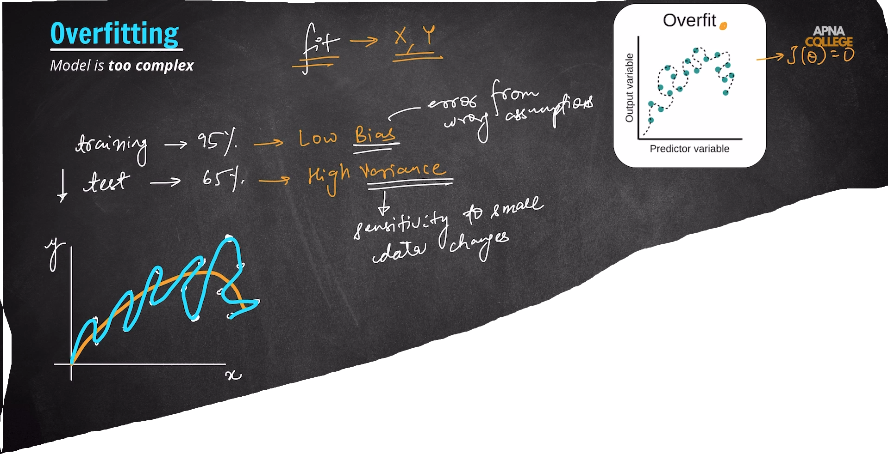

# 🤖 Introduction to Machine Learning

  
  
  

---

## 📚 What is Machine Learning?

> Machine Learning (ML) is a branch of Computer Science where computers learn from data, identify patterns, and make decisions or predictions without being explicitly programmed for every task.

---

## 🧠 Types of Machine Learning

| Type                      | Description                             |
| ------------------------- | --------------------------------------- |
| 🎯 Supervised Learning    | Learns from labeled data                |
| 🔍 Unsupervised Learning  | Finds hidden patterns in unlabeled data |
| 🎮 Reinforcement Learning | Learns through rewards and penalties    |

---

## 🎯 Supervised Learning

> Supervised Learning trains algorithms using **labeled datasets**, where each input has a known correct output. The model learns patterns and predicts outcomes for unseen data.

---

## 📈 Types of Supervised Learning Problems

### 1️⃣ Regression

Predicts a **continuous numerical value**.

#### Examples

* 🏠 House Price Prediction
* 📊 Stock Price Prediction
* 🌡️ Temperature Forecasting

---

### 2️⃣ Classification

Predicts a **category or class**.

#### Examples

* 📧 Spam Email Detection
* 💳 Fraud Detection
* 🏥 Disease Prediction

---

## 🏷️ Types of Classification Problems

### 🔵 Binary Classification

Predicts one of **two classes**.

**Examples:**

* Yes / No
* Spam / Not Spam
* Fraud / Not Fraud

---

### 🟢 Multiclass Classification

Predicts one of **multiple classes**.

**Examples:**

* 🐶 Animal Species Prediction
* ✍️ Handwritten Digit Recognition (0-9)

---

### 🟣 Multilabel Classification

A single output can belong to **multiple classes simultaneously**.

**Examples:**

* 🎬 Movie Genre Prediction
* 🖼️ Image Tagging

---

## ⚙️ Scikit-Learn

**Scikit-Learn** is an open-source Machine Learning library built on top of:

* 🔢 NumPy
* 📐 SciPy
* 📊 Matplotlib

### ✨ Features

✅ Easy to Learn
✅ Open Source
✅ Efficient ML Algorithms
✅ Data Preprocessing Tools
✅ Model Evaluation Tools

### 📖 Supports

* 🎯 Supervised Learning
* 🔍 Unsupervised Learning

---

## 🚀 Popular Scikit-Learn Algorithms

| Algorithm                      | Use Case                    |
| ------------------------------ | --------------------------- |
| 📈 Linear Regression           | Regression                  |
| 🎯 Logistic Regression         | Classification              |
| 👥 K-Nearest Neighbors (KNN)   | Regression & Classification |
| 🌳 Decision Trees              | Regression & Classification |
| 📧 Naive Bayes                 | Classification              |
| ⚡ Support Vector Machine (SVM) | Classification & Regression |

---

# 📈 Linear Regression  ->

## 1. Feature Engineering - Encoding ->()

### 1.1 - One Hot Encoding
### 1.2 - Interaction Features
### 1.3 - overfitting

### 1.3 - underfitting

### 1.4 - fix overfitting & underfitting

